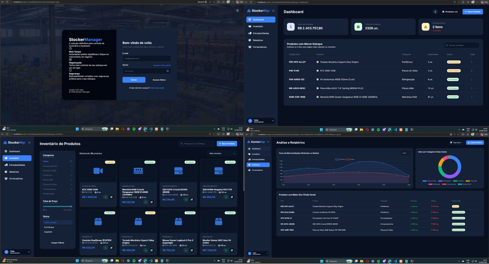
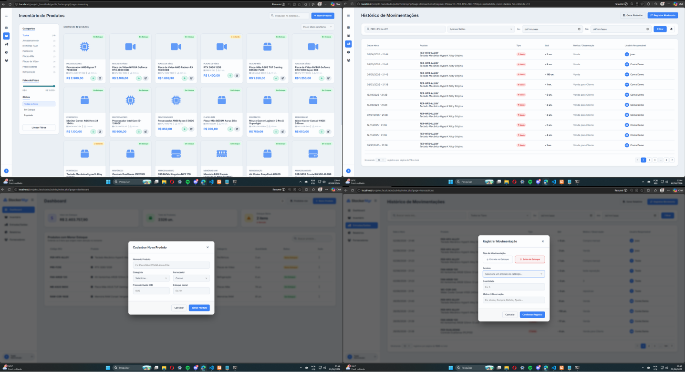

# 📦 Stocker Manager

Um sistema web completo para gestão de inventário e controle logístico. Desenvolvido com foco rigoroso em integridade de dados, arquitetura limpa e performance, operando através de uma estrutura MVC robusta e sem o uso de frameworks externos.

> **Status do Projeto:** Concluído - Projeto Acadêmico

## 🎯 Visão Geral
O **Stocker Manager** resolve o problema clássico de desvio e controle de estoque de forma transacional. O sistema não apenas gerencia as quantidades, mas registra todo o ciclo de vida do produto (entradas, saídas, reposições e motivos), garantindo que os dados armazenados reflitam a realidade física através de **validações em dupla camada** (Backend + Banco de Dados).

## ✨ Funcionalidades Principais

* **Gestão de Inventário e Reposição Rápida:** Cadastro completo de produtos (SKU dinâmico, fornecedores, categorias e precificação).
* **Controle Transacional de Movimentações:** Toda entrada e saída exige justificativa e rastreio de usuário, executada de forma atômica no banco de dados para evitar concorrência.
* **Prevenção de Estoque Negativo:** O sistema conta com uma barreira de segurança dupla (Verificação lógica em PHP e `CHECK constraints` diretas no PostgreSQL) abortando operações que deixariam o saldo negativo e gerando feedback visual sem recarregar os dados da tela.
* **Visualização Dinâmica de Fornecedores:** Chamadas assíncronas via **Fetch API** no frontend para listar produtos de parceiros comerciais em modais rápidos, sem necessidade de *refresh*.
* **Exportação de Dados:** Geração automatizada de relatórios transacionais em formato `.CSV`, facilitando auditorias e análises externas.
* **Interface Fluida (Dark Mode):** UI moderna focada em UX, utilizando *Event Delegation* para alta performance e manipulação de histórico do navegador para navegação limpa por abas.

## 🛠️ Stack Tecnológica e Arquitetura

O projeto foi construído "do zero"(No começo pretendia fazer algo mais básico, mas quis me testar no frontend, além de aprender mais sobre PHP) no padrão **MVC (Model-View-Controller)**, assegurando uma separação clara de responsabilidades: roteamento centralizado, regras de negócios blindadas e visualização independente.

**Backend & Lógica:**
* **PHP 8+ (Vanilla/Orientado a Objetos):** Controladores isolados para cada domínio (`ProdutoController`, `TransactionController`, etc.).
* **PDO (PHP Data Objects):** Abstração de acesso ao banco com _Prepared Statements_ para total prevenção contra SQL Injection.

**Banco de Dados:**
* **PostgreSQL:** Modelagem relacional estrita. Uso de Sequences, Foreign Keys (Categorias/Fornecedores..) e Constraints (`quantidade_atual >= 0`) assegurando a confiabilidade transacional.

**Frontend:**
* **JavaScript (Vanilla / ES6+):** Código assíncrono moderno, dispensando JQuery. Estrutura de diretórios enxuta com scripts diretos na raiz da pasta `js/`.
* **HTML5 & CSS3:** Semântico e responsivo, estilizado de forma nativa.

## 📁 Estrutura de Diretórios Destaque
```text
/app
 ├── /Controllers     # Lógica de intermediação e redirecionamento de rotas seguras
 ├── /Models          # Consultas SQL, Transações PDO e validações de regras de negócios
 ├── /Views           # Interface do usuário (HTML encapsulado com PHP)
 │    └── /partials   # Componentes visuais reutilizáveis (Sidebar, Modais dinâmicos)
/config
 ├── database.php     # Configurações de acesso e instanciamento do PDO
 ├── schema.sql       # Script oficial de estruturação econstraints do banco relacional além de ser seeder para testes
/public
 ├── /css             # Estilizações modulares do frontend
 ├── /js              # Lógica de interface, Fetch APIs e Event Delegation (main.js)
 └── index.php        # Ponto de entrada único (Front Controller) e roteador central
```

## 🚀 Como Executar Localmente

1. Clone o repositório:
```bash
git clone [https://github.com/joaorozadev/stocker-manager.git](https://github.com/joaorozadev/stocker-manager.git)
```
2. Configuração do PostgreSQL:
```
Crie um banco de dados vazio chamado stocker_manager.

Execute o arquivo config/schema.sql no seu SGBD (pgAdmin, DBeaver, etc.) para montar todas as tabelas, chaves primárias e constraints de proteção.
```
3. Ambiente Web (PHP):
```
Mova o projeto para a pasta do seu servidor web local (ex: htdocs no XAMPP).

Altere as credenciais no arquivo config/database.php para apontar para o seu usuário/senha do Postgres.(Recomendo criar um arquivo .env para isso)
```
4. Acesso:
```
Inicie o Apache.

Abra o navegador e acesse a URL da pasta public/: http://localhost/stocker-manager/public/index.php. O roteador assumirá a partir daqui.
```
## 📸 Capturas de Tela




## 📚 Referências e Materiais de Estudo

Durante o desenvolvimento deste projeto, os seguintes materiais e comunidades foram essenciais para a construção da interface e resolução de problemas técnicos:

**UI/UX e Frontend**
* [Dribbble - Inventory & Supply Chain Management](https://dribbble.com/shots/24501848-Inventory-and-Supply-chain-Management) - Inspiração principal para a paleta de cores e disposição visual do Dashboard.
* [CodingNepal - Sidebar Menu Templates](https://www.codingnepalweb.com/free-sidebar-menu-templates/) - Referência estrutural e visual para a criação da navegação lateral responsiva.

**Comunidade e Consultas Técnicas**
* [Stack Overflow](https://stackoverflow.com/) - Consulta recorrente para a resolução de bugs pontuais de manipulação de DOM com JavaScript e comportamento de rotas no PHP.
## 🧑‍💻 Autor

**João Pedro Souza Salvino Roza**
* Estagiário de Dados e Desenvolvedor Full-Stack
* Estudante de Análise e Desenvolvimento de Sistemas (ADS)
* 💼 [LinkedIn](https://www.linkedin.com/in/joão-pedro-souza-bb0b5a273/)
* 🐙 [GitHub]([https://github.com/SEU-USUARIO-AQUI](https://github.com/joaorozadev))
